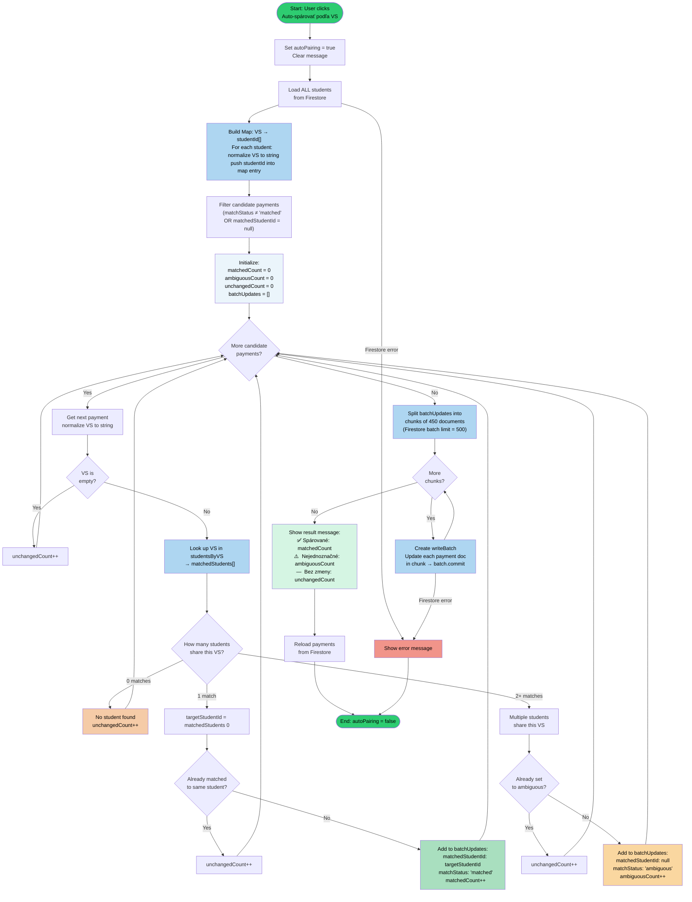

# Flowchart: Payment Auto-Matching by VS

**Source:** `dst-crm/src/components/PaymentsManagement.tsx` → `autoAssignByVS()`

**Purpose:** Automatically pairs imported payments to students by comparing the payment's
variable symbol (`vs`) against each student's `vs` field. Handles exact matches, ambiguous
matches (multiple students share a VS), and unmatched cases. Uses Firestore batch writes.

---

---

## Algorithm Summary

| Step | Operation | Complexity |
|------|-----------|-----------|
| Build student map | Iterate all students once | O(n) |
| Filter candidates | Iterate all payments once | O(m) |
| Main loop | For each candidate, O(1) map lookup | O(m) |
| Batch write | Firestore batch commits in ≤450 chunks | O(b/450) |

**Legend:**
- 🟢 Green — Start / End
- 🔵 Blue — Data operations (Firestore read/write, map build)
- 🟩 Light green — Match confirmed → write `matched`
- 🟧 Orange — Ambiguous match → write `ambiguous`
- 🟥 Red — Error path
