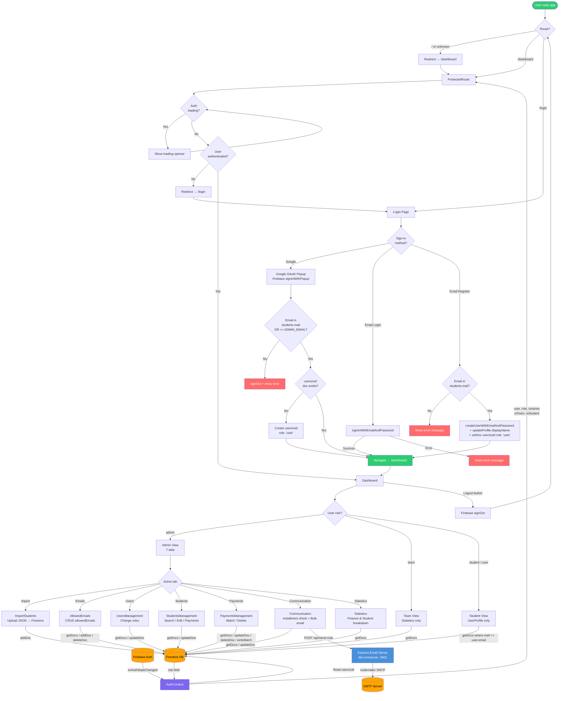

# System Flowchart — DST CRM

```mermaid
flowchart TD
    START([User visits app]) --> ROOT_ROUTE{Route?}

    ROOT_ROUTE -->|"/ or unknown"| REDIR[Redirect → /dashboard]
    REDIR --> PR
    ROOT_ROUTE -->|"/dashboard"| PR

    %% ── PROTECTED ROUTE GUARD ──────────────────────────────
    PR[ProtectedRoute] --> LOADING{Auth\nloading?}
    LOADING -->|Yes| SPINNER[Show loading spinner]
    SPINNER --> LOADING
    LOADING -->|No| AUTHED{User\nauthenticated?}
    AUTHED -->|No| ROOT_ROUTE2[Redirect → /login]
    ROOT_ROUTE2 --> LOGIN_PAGE

    %% ── AUTH CONTEXT ────────────────────────────────────────
    FBAUTH[(Firebase Auth)] -->|onAuthStateChanged| AUTHCTX[AuthContext]
    AUTHCTX -->|Read users/uid| FIRESTORE[(Firestore DB)]
    FIRESTORE -->|role field| AUTHCTX
    AUTHCTX -->|user, role, isAdmin\nisTeam, isStudent| PR

    %% ── LOGIN PAGE ──────────────────────────────────────────
    ROOT_ROUTE -->|"/login"| LOGIN_PAGE[Login Page]
    LOGIN_PAGE --> METHOD{Sign-in\nmethod?}

    METHOD -->|Google| GOOGLE_POPUP[Google OAuth Popup\nFirebase signInWithPopup]
    GOOGLE_POPUP --> WL_CHECK{Email in\nstudents.mail\nOR == ADMIN_EMAIL?}
    WL_CHECK -->|No| SIGNOUT[signOut + show error]
    WL_CHECK -->|Yes| USER_EXISTS{users/uid\ndoc exists?}
    USER_EXISTS -->|No| CREATE_USER[Create users/uid\nrole: 'user']
    USER_EXISTS -->|Yes| NAV_DASH
    CREATE_USER --> NAV_DASH[Navigate → /dashboard]

    METHOD -->|Email Login| FB_LOGIN[signInWithEmailAndPassword]
    FB_LOGIN -->|Success| NAV_DASH
    FB_LOGIN -->|Error| LOGIN_ERR[Show error message]

    METHOD -->|Email Register| REG_WL{Email in\nstudents.mail?}
    REG_WL -->|No| REG_ERR[Show error message]
    REG_WL -->|Yes| CREATE_ACCT[createUserWithEmailAndPassword\n+ updateProfile displayName\n+ setDoc users/uid role: 'user']
    CREATE_ACCT --> NAV_DASH

    %% ── DASHBOARD ───────────────────────────────────────────
    AUTHED -->|Yes| DASH[Dashboard]
    NAV_DASH --> DASH

    DASH --> ROLE_CHECK{User role?}
    ROLE_CHECK -->|admin| ADMIN_VIEW[Admin View\n7 tabs]
    ROLE_CHECK -->|team| TEAM_VIEW[Team View\nStatistics only]
    ROLE_CHECK -->|student / user| STUDENT_VIEW[Student View\nUserProfile only]

    %% ── ADMIN TABS ──────────────────────────────────────────
    ADMIN_VIEW --> TAB{Active tab}
    TAB -->|Import| IMP[ImportStudents\nUpload JSON → Firestore]
    TAB -->|Emails| AEMAILS[AllowedEmails\nCRUD allowedEmails]
    TAB -->|Users| UMGMT[UsersManagement\nChange roles]
    TAB -->|Students| SMGMT[StudentsManagement\nSearch / Edit / Payments]
    TAB -->|Payments| PMGMT[PaymentsManagement\nMatch / Delete]
    TAB -->|Communication| COMM[Communication\nInstallment check + Bulk email]
    TAB -->|Statistics| STATS[Statistics\nFinance & Student breakdown]

    %% ── DATA LAYER ──────────────────────────────────────────
    IMP -->|addDoc| FIRESTORE
    AEMAILS -->|getDocs / addDoc / deleteDoc| FIRESTORE
    UMGMT -->|getDocs / updateDoc| FIRESTORE
    SMGMT -->|getDocs / updateDoc| FIRESTORE
    PMGMT -->|getDocs / updateDoc / deleteDoc / writeBatch| FIRESTORE
    COMM -->|getDocs / updateDoc| FIRESTORE
    STATS -->|getDocs| FIRESTORE
    TEAM_VIEW -->|getDocs| FIRESTORE
    STUDENT_VIEW -->|getDocs where mail == user.email| FIRESTORE

    COMM -->|POST /api/send-mail| EMAIL_SRV[Express Email Server\ndst-crm/server :3001]
    EMAIL_SRV -->|nodemailer SMTP| SMTP_OUT[(SMTP Server)]

    %% ── LOGOUT ──────────────────────────────────────────────
    DASH -->|Logout button| LOGOUT[Firebase signOut]
    LOGOUT --> ROOT_ROUTE

    %% ── STYLES ──────────────────────────────────────────────
    style FIRESTORE fill:#FFA500,color:#000
    style FBAUTH fill:#FFA500,color:#000
    style SMTP_OUT fill:#FFA500,color:#000
    style EMAIL_SRV fill:#4A90D9,color:#fff
    style AUTHCTX fill:#7B68EE,color:#fff
    style SIGNOUT fill:#FF6B6B,color:#fff
    style LOGIN_ERR fill:#FF6B6B,color:#fff
    style REG_ERR fill:#FF6B6B,color:#fff
    style START fill:#2ECC71,color:#fff
    style NAV_DASH fill:#2ECC71,color:#fff
```
